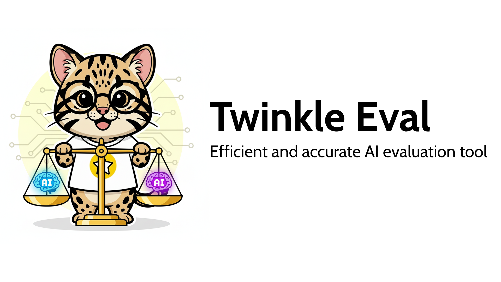

# Twinkle Eval -- High-Performance LLM Evaluation Framework

[🇺🇸 English](README_EN.md) | 🇹🇼 繁體中文

[](https://www.python.org)
[](https://pypi.org/project/twinkle-eval/)


[](https://discord.gg/Cx737yw4ed)
[](https://huggingface.co/twinkle-ai)

Twinkle Eval 是一個以**並行 API 請求**為核心的 LLM 評測框架，支援選擇題、數學推理、指令遵循、函式呼叫、長文本理解、RAG、Text-to-SQL 等多類型評測。透過 OpenAI 相容 API 呼叫已部署的模型端點，單機即可完成完整評測流程。

---

## 目錄

- [為什麼選擇 Twinkle Eval](#為什麼選擇-twinkle-eval)
- [支援的評測資料集](#支援的評測資料集)
- [評測方法一覽](#評測方法一覽)
- [安裝](#安裝)
- [快速開始](#快速開始)
- [CLI 參考](#cli-參考)
- [設定檔](#設定檔)
- [輸出格式](#輸出格式)
- [排行榜](#排行榜)
- [貢獻者](#貢獻者)
- [授權條款](#授權條款)
- [引用](#引用)
- [致謝](#致謝)

---

## 為什麼選擇 Twinkle Eval

2025 年推理模型（reasoning model）大量出現，每次 API 回應時間大幅增加。傳統評測框架逐題同步呼叫，一個 benchmark 動輒數小時。Twinkle Eval 以 `ThreadPoolExecutor` 並行送出請求，實測比 [iKala/ievals](https://github.com/iKala/ievals) 快 **9--17 倍**，讓評測不再是訓練迭代的瓶頸。


上圖為 [ikala/tmmluplus](https://huggingface.co/datasets/ikala/tmmluplus) -- basic_medical_science（954 題）的實測結果：

| 模型 | ievals | Twinkle Eval | 加速倍率 |
|------|--------|-------------|---------|
| Llama-3.2-3B-Instruct | 325s | 34s | 9.4x |
| DeepSeek-R1-Distill-Llama-8B | 1,672s | 99s | 16.9x |
| Mistral-Small-24B-Instruct | 1,299s | 90s | 14.5x |

**其他特點：**

- 選項隨機排列，消除位置偏好（[參考](https://arxiv.org/html/2406.19470v1)）
- 多次執行 + 標準差，量化模型穩定性
- Config-driven 設計，所有行為透過 YAML 控制
- `pip install twinkle-eval` 即裝即用，不需要 GPU 或叢集

---

## 支援的評測資料集

Twinkle Eval 內建 23 個評測資料集的下載支援，涵蓋 9 大評測類型。所有資料集皆可透過 `--download-dataset` 一鍵下載。

### 選擇題（Multiple Choice）

| 資料集 | 來源 | 說明 | 評測方法 |
|--------|------|------|---------|
| [MMLU](https://huggingface.co/datasets/cais/mmlu) | HuggingFace | 57 科目大規模多任務語言理解 | `box` |
| [MMLU-Pro](https://huggingface.co/datasets/TIGER-Lab/MMLU-Pro) | HuggingFace | 更具鑑別力的多任務理解（10 選項） | `box` |
| [MMLU-Redux](https://huggingface.co/datasets/edinburgh-dawg/mmlu-redux) | HuggingFace | MMLU 修正版（3000 題人工重新標注） | `box` |
| [TMMLU+](https://huggingface.co/datasets/ikala/tmmluplus) | HuggingFace | 繁體中文多任務語言理解 | `box` |
| [SuperGPQA](https://huggingface.co/datasets/m-a-p/SuperGPQA) | HuggingFace | 研究生等級跨領域問答 | `box` |
| [GPQA](https://huggingface.co/datasets/Idavidrein/gpqa) | HuggingFace | Google 研究等級科學問答（gated） | `box` |
| [Formosa-bench](https://huggingface.co/datasets/lianghsun/Formosa-bench) | HuggingFace | 台灣在地化多科目評測 | `box` |

### 數學推理（Math Reasoning）

| 資料集 | 來源 | 說明 | 評測方法 |
|--------|------|------|---------|
| [GSM8K](https://huggingface.co/datasets/openai/gsm8k) | HuggingFace | 小學數學推理（8.5K 題） | `math` |
| [AIME 2025](https://huggingface.co/datasets/MathArena/aime_2025) | HuggingFace | 美國數學邀請賽（高難度） | `math` |

### 正則匹配（Regex Match）

| 資料集 | 來源 | 說明 | 評測方法 |
|--------|------|------|---------|
| [BIG-Bench Hard](https://huggingface.co/datasets/lukaemon/bbh) | HuggingFace | 27 個高難度推理子任務 | `regex_match` |

### 指令遵循（Instruction Following）

| 資料集 | 來源 | 說明 | 評測方法 |
|--------|------|------|---------|
| [IFEval](https://huggingface.co/datasets/google/IFEval) | HuggingFace | Google 25 類指令遵循評測 | `ifeval` |
| [IFBench](https://huggingface.co/datasets/Yale-LILY/IFBench) | HuggingFace | 58 類 OOD 指令遵循評測 | `ifbench` |

### 函式呼叫（Function Calling）

| 資料集 | 來源 | 說明 | 評測方法 |
|--------|------|------|---------|
| [BFCL](https://huggingface.co/datasets/gorilla-llm/Berkeley-Function-Calling-Leaderboard) | HuggingFace | Berkeley 函式呼叫排行榜 | `bfcl_fc` |

### 長文本理解（Long Context）

| 資料集 | 來源 | 說明 | 評測方法 |
|--------|------|------|---------|
| [NeedleBench](https://huggingface.co/datasets/opencompass/NeedleBench) | HuggingFace | 多語言大海撈針測試 | `niah` |
| [LongBench](https://github.com/THUDM/LongBench) | GitHub | 中文段落檢索長文本理解 | `niah` |

### RAG 品質評估

| 資料集 | 來源 | 說明 | 評測方法 |
|--------|------|------|---------|
| [WikiEval](https://huggingface.co/datasets/explodinggradients/WikiEval) | HuggingFace | RAG 品質評估（RAGAS 框架） | `ragas` |

### 語音辨識（ASR）

| 資料集 | 來源 | 說明 | 評測方法 |
|--------|------|------|---------|
| [LibriSpeech](https://huggingface.co/datasets/openslr/librispeech_asr) | HuggingFace | 英文朗讀語音辨識（WER） | `asr` |
| [Aishell-1](https://huggingface.co/datasets/carlot/AIShell) | HuggingFace | 中文普通話語音辨識（CER） | `asr` |
| [Fleurs](https://huggingface.co/datasets/google/fleurs) | HuggingFace | 102 語言多語言語音辨識 | `asr` |
| [Common Voice](https://huggingface.co/datasets/mozilla-foundation/common_voice_17_0) | HuggingFace | 群眾外包多語言語音辨識 | `asr` |

### Text-to-SQL

| 資料集 | 來源 | 說明 | 評測方法 |
|--------|------|------|---------|
| [Spider 1.0](https://huggingface.co/datasets/xlangai/spider) | HuggingFace | 跨資料庫 Text-to-SQL | `text2sql` |
| [BIRD](https://bird-bench.github.io/) | GitHub | 大規模跨資料庫 Text-to-SQL（95 個資料庫） | `text2sql` |
| [Spider 2.0-lite](https://github.com/xlang-ai/Spider2) | GitHub | 85 題 SQLite Text-to-SQL | `text2sql` |

---

## 評測方法一覽

每種評測方法由一組 Extractor（從模型輸出提取答案）與 Scorer（評分）構成：

| 方法名稱 | 適用場景 | 說明 |
|---------|---------|------|
| `pattern` | 選擇題 | 正則表達式匹配答案字母 |
| `box` | 選擇題 | 從 `\boxed{}` 格式提取答案 |
| `logit` | 選擇題 | 基於 log probability 評分（需 completions API） |
| `math` | 數學推理 | 從 `\boxed{}` 提取 + MathRuler 語意等價判斷 |
| `regex_match` | 自由格式推理 | 正則匹配 + 字串完全比對 |
| `custom_regex` | 自訂格式 | 使用者自訂正則表達式 |
| `ifeval` | 指令遵循 | Google IFEval 25 類指令檢查器 |
| `ifbench` | 指令遵循 | Yale IFBench 58 類指令檢查器 |
| `bfcl_fc` | 函式呼叫 | 透過 function calling API 呼叫並比對結果 |
| `bfcl_prompt` | 函式呼叫 | 透過 prompt 產生 JSON 呼叫並比對結果 |
| `niah` | 長文本 | 大海撈針（Needle in a Haystack）段落檢索 |
| `ragas` | RAG | 以 LLM-as-Judge 評估 RAG 品質 |
| `asr` | 語音辨識 | WER/CER 計算（支援 Whisper API 與 Chat Completions 多模態） |
| `text2sql` | Text-to-SQL | SQL 執行結果比對 |

---

## 安裝

```bash
# 基本安裝
pip install twinkle-eval

# 數學評測（GSM8K、AIME）
pip install twinkle-eval[math]

# 語音辨識（ASR）
pip install twinkle-eval[asr]

# 指令遵循（IFEval）
pip install twinkle-eval[ifeval]

# 指令遵循（IFBench）
pip install twinkle-eval[ifbench]

# 函式呼叫（BFCL）
pip install twinkle-eval[tool]

# Slurm 多節點 + HuggingFace 上傳
pip install twinkle-eval[slurm]

# 開發環境
pip install twinkle-eval[dev]

# 從原始碼安裝
git clone https://github.com/ai-twinkle/Eval.git
cd Eval && pip install -e ".[dev]"
```

---

## 快速開始

### 1. 產生設定範本

```bash
# 列出所有可用範本
twinkle-eval --init

# 產生選擇題評測設定檔
twinkle-eval --init multiple_choice

# 產生數學評測設定檔
twinkle-eval --init math

# 一次產生所有範本
twinkle-eval --init all
```

可用範本：`multiple_choice`、`math`、`regex_match`、`ifeval`、`ifbench`、`bfcl`、`niah`、`ragas`、`text2sql`

### 2. 下載評測資料集

```bash
# 列出所有可下載的資料集
twinkle-eval --download-dataset list

# 下載單一資料集
twinkle-eval --download-dataset mmlu

# 下載多個資料集
twinkle-eval --download-dataset mmlu gsm8k ifeval

# 下載全部 19 個資料集
twinkle-eval --download-dataset all

# 直接指定 HuggingFace ID（向下相容）
twinkle-eval --download-dataset ikala/tmmluplus
```

### 3. 編輯設定檔

將 `base_url` 指向你已部署的 OpenAI 相容 API 端點，填入 `api_key`，設定 `dataset_paths` 和 `evaluation_method`。

### 4. 執行評測

```bash
# 正式執行
twinkle-eval --config config.yaml

# 驗證設定檔格式
twinkle-eval --validate --config config.yaml

# 預覽評測計畫（不呼叫 API）
twinkle-eval --dry-run --config config.yaml

# 從中斷點恢復
twinkle-eval --resume 20260401_1430 --config config.yaml
```

### Python API

```python
from twinkle_eval import TwinkleEvalRunner

runner = TwinkleEvalRunner("config.yaml")
runner.initialize()
results = runner.run_evaluation(export_formats=["json", "csv"])
```

---

## CLI 參考

| 選項 | 說明 |
|------|------|
| `--config PATH` | 指定設定檔路徑 |
| `--init [NAME]` | 產生設定範本（無參數列出所有範本） |
| `--download-dataset NAME [NAME ...]` | 下載評測資料集（支援短名稱、HuggingFace ID、`all`、`list`） |
| `--validate` | 驗證設定檔格式與資料集路徑 |
| `--dry-run` | 載入設定與資料集，顯示評測計畫但不呼叫 API |
| `--resume TIMESTAMP` | 從指定時間戳的中斷點繼續評測 |
| `--export FORMAT [FORMAT ...]` | 輸出格式（json, csv, html） |
| `--finalize-results TIMESTAMP` | 合併分散式評測碎片並重新計算指標 |
| `--hf-repo-id REPO` | 評測完成後上傳結果至 HuggingFace |
| `--list-llms` | 列出支援的 LLM 類型 |
| `--list-strategies` | 列出支援的評測方法 |
| `--list-exporters` | 列出支援的輸出格式 |
| `--version` | 顯示版本 |

---

## 設定檔

設定檔使用 YAML 格式。以下為選擇題評測的最小範例：

```yaml
llm_api:
  base_url: "http://localhost:8000/v1"
  api_key: "your-api-key"
  api_rate_limit: -1        # QPS，-1 為不限制
  max_retries: 5
  timeout: 600

model:
  name: "your-model-name"
  temperature: 0.0
  max_tokens: 4096

evaluation:
  dataset_paths:
    - "datasets/mmlu/"
    - "datasets/tmmluplus/"
  evaluation_method: "box"
  system_prompt:
    zh: |
      使用者將提供一個題目，並附上選項。
      請選出最正確的選項，以 \box{選項} 格式回答。
    en: |
      Select the best option and answer in \box{Option} format.
  datasets_prompt_map:
    "datasets/mmlu/": "en"
  repeat_runs: 3
  shuffle_options: true

logging:
  level: "INFO"
```

其他評測類型的設定範本可透過 `twinkle-eval --init` 取得。完整設定欄位說明請參閱各範本檔案中的註解。

---

## 輸出格式

評測結果儲存在 `results/` 目錄：

| 檔案 | 格式 | 內容 |
|------|------|------|
| `results_{timestamp}.json` | JSON | 整體評測摘要（設定、各資料集 accuracy、執行時間） |
| `eval_results_{timestamp}_run{N}.jsonl` | JSONL | 每題詳細記錄（題目、正確答案、預測答案、是否正確） |

---

## 排行榜

最新模型評測結果請參閱 [TW Eval Leaderboard](https://apps.twinkleai.tw/tw-eval-leaderboard/?lang=zh-TW)。

---

## 貢獻者

[](https://github.com/teds-lin)
[](https://github.com/lianghsun)
[](https://github.com/cyc00518)
[](https://github.com/k1dav)
[](https://github.com/thliang01)
[](https://github.com/whats2000)

本專案由 [Twinkle AI](https://github.com/ai-twinkle) 與 [APMIC](https://www.apmic.ai/) 合作開發。

---

## 授權條款

本專案以 [MIT License](https://github.com/ai-twinkle/Eval?tab=MIT-1-ov-file#readme) 授權開源。

## 引用

```bibtex
@misc{twinkle_eval,
  author       = {Teds Lin and Liang Hsun Huang and Min Yi Chen and Dave Sung and Thomas Liang and Ren-Di Wu},
  title        = {Twinkle Eval: An Efficient and Accurate AI Evaluation Tool},
  year         = {2025},
  url          = {https://github.com/ai-twinkle/Eval},
  note         = {GitHub repository}
}
```

## 致謝

在本專案的開發過程中，我們參考了 [iKala/ievals](https://github.com/iKala/ievals) 專案的模式設計理念，該專案對設計方向提供了寶貴的啟發，特此致上誠摯感謝。
